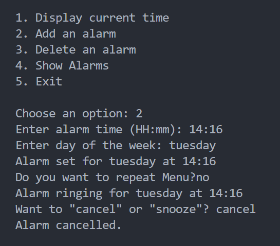

<h1 align="center" id="title">Alarm Clock using CLI</h1>

In this project I have implemented alarm clock. As it has been asked in the requirement that the working should be purely based on CLI So I have used "readline" in-built module to successfully complete the project.

<h2>Steps to Run The Project</h2>

Make sure you have node as running environment

<ul>
  <li>First Clone the project</li>
  <li>Run npm install (for momentjs)</li>
  <li>node index.js</li>
</ul>

<h2>Project Working Screenshots:</h2>

<h4>Alarm Rings</h4>

<h4>Cancel Alarm</h4>

<h4>Delete Alarm</h4>

<h4>Display Time</h4>

<h4>Set Alarm</h4>

<h4>Show Alarm</h4>

<h4>Snooze Alarm</h4>

